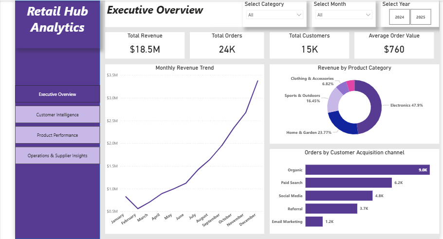
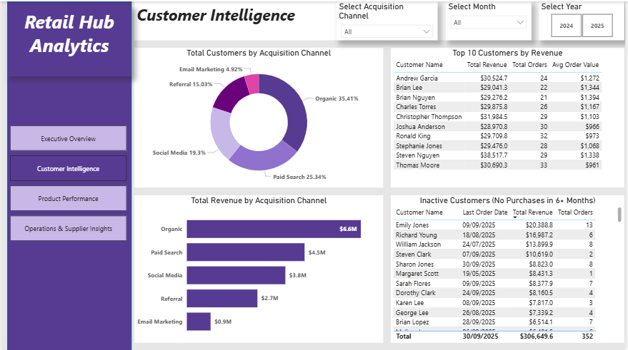
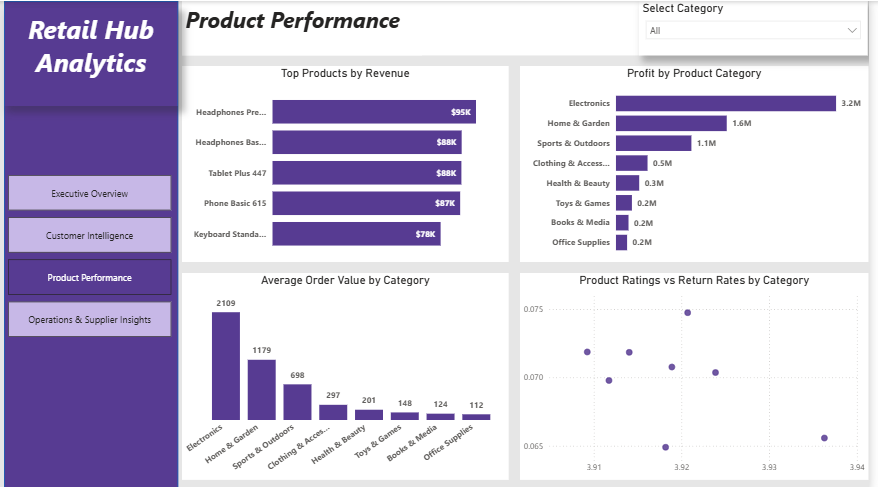
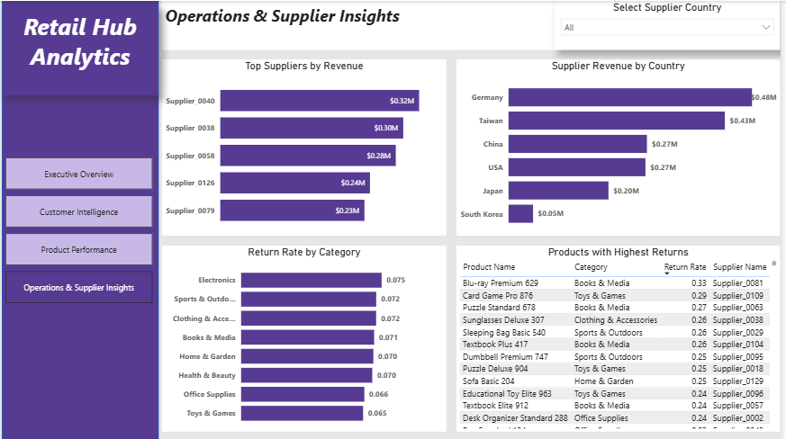

# Retail Hub Analytics

Transforming E-commerce Data into Strategic Business Insights. 
---

## 📌 Project Overview  
This project presents a complete end-to-end business analytics solution for a fictional e-commerce company, Retail Hub. The objective was to transform fragmented transactional data into a structured database and generate actionable insights to support strategic decision-making.  

The project covers:  
    •	Data modeling and database design  
	•	SQL-based analytical queries  
	•	Business insight generation  
	•	Interactive dashboard development in Power BI  

## 🎯 Business Objectives  

The analysis focuses on solving key business challenges:  
• Identify high-value customers and improve retention  
• Evaluate marketing channel effectiveness  
• Detect inactive (at-risk) customers  
• Optimize product mix and profitability  
• Analyze supplier performance  
• Understand sales trends and seasonality  

---

 ## 🗂️ Dataset  

The dataset is based on the Brazilian E-Commerce Public Dataset by Olist (Kaggle) and was enhanced with additional fields to simulate a real-world business environment.  

Key Data Components:  
	•	15,000 customers  
	•	25,000 orders  
	•	45,000+ order items  
	•	2,000 products across 8 categories  
	•	150 suppliers  
	•	29,000+ reviews  
	•	3,000+ returns  

---

## 🏗️ Data Model  

The database was designed using Third Normal Form (3NF) to ensure:  
	•	Minimal redundancy  
	•	Data integrity  
	•	Efficient querying  

Core Tables:  
	•	Customers  
	•	Orders  
	•	Order_Items  
	•	Products  
	•	Categories  
	•	Suppliers  
	•	Reviews  
	•	Returns  

An Entity-Relationship Diagram (ERD) was created using ChartDB to visualize table relationships.  

⚙️ **Tools and Technologies**  
	•	PostgreSQL – Database management  
	•	pgAdmin 4 – Query execution  
	•	Power BI – Data visualization and dashboarding   
	•	ChartDB – ER diagram design  

---

## Dashboard Preview  
## Overview Page

## Customer Intelligence

## Product Performance

## Operations & Supplier Insights

📊 Key Analyses  

The project includes 10 SQL-based analyses:  
	1.	Most valuable customers  
	2.	Marketing channel performance  
	3.	Inactive customers (6+ months)  
	4.	Most profitable product categories  
	5.	Top-performing products  
	6.	Categories driving highest order value  
	7.	Products with high return rates (quality issues)  
	8.	Cross-sell opportunities  
	9.	Supplier performance evaluation  
	10.	Sales trends over time  

## 📖 Key Findings & Recommendations  
🎯 **Customer Strategy**  
Top 10 customers generate $140K+ with $2,437 average order value (3x company average).  
10 high-value customers representing $110K revenue are inactive 6+ months.  
**Recommendations:**  
	∙	Offer personalized benefits: early product access, free premium shipping  
	∙	Launch immediate win-back campaign with 25-30% discount offers  
	∙	Personalize outreach based on previous purchase patterns  
	∙	Expected recovery: $25-30K from 25-30% win-back rate  

💰**Marketing Optimization**  
Social Media delivers $1,298 LTV vs Paid Search $1,181 LTV (10% difference)  
**Recommendations:**  
	∙	Reallocate 30% of Paid Search budget to Social Media campaigns  
	∙	Double down on Organic SEO ($1,249 LTV with near-zero acquisition cost)  
	∙	Expected impact: 15-20% improvement in marketing ROI  

📦 **Product & Inventory**    
Electronics drives 44% revenue ($8.4M) with 37.6% margin; Toys & Games shows highest margin at 38.5%  
Return rates >20% concentrated in Sports & Outdoors and Books & Media  
**Recommendations:**  
	∙	Expand Electronics and Toys & Games product selection by 20-30%  
	∙	Reduce inventory in Books & Media (only $484K revenue, 5% of total)  
	∙	Audit suppliers for problem products (Sleeping Bag Basic: 26% return rate)
	∙	Implement supplier KPI: >15% return rate triggers performance review  

🔄 **Cross-Selling Opportunity**  
Only 1.3% of orders contain multiple categories (98.7% single-category)  
**Recommendations:**  
	∙	Implement “Frequently Bought Together” recommendations  
	∙	Create curated bundles (e.g., “Athleisure Set”: Clothing + Sports)  
	∙	Offer bundle discounts: 10% off for 2+ categories  
	∙	Expected impact: Increase to 5-7% multi-category orders = +$1.5-2M annual revenue  

📅 **Seasonal Planning**    
Q4 (Nov-Dec) represents 35% of annual revenue with 25% MoM growth  
**Recommendations:**  
	∙	Build inventory in August-September (before growth acceleration)  
	∙	Hire seasonal staff in October  
	∙	Lock in supplier pricing and capacity by July  
	∙	Launch major campaigns in October to capitalize on momentum  

## Next Steps  
• Develop predictive models for churn and customer lifetime value  
• Implement recommendation systems for cross-selling  
• Expand dataset to include marketing and logistics data  

## Project Resources  
• **Dataset Source:**  
• **SQL (DDL + Queries):**  
• **Power BI Dashboard:**  
